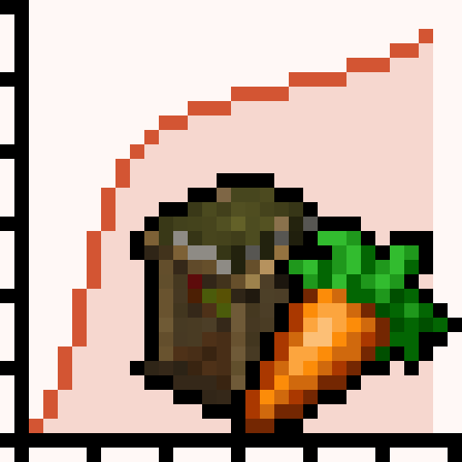

# Spice of Minecolonies Life: Carrot Flavor

## Description
MineColonies's citizens can be get bonus hearts eating a variety of foods. 
Like a 'Spice of Life: Carrot Edition'. 
It is not necessary to install 'Spice of Life: Carrot Edition', just optional.
 
## Features
1. Hearts rewarding for eating a variety of foods.
2. Configurable hearts, milestone and food black/whitelist.
3. If 'Spice of Life: Carrot Edition' is installed, config values ​​can follow automatically.
4. Use 'Citizen Food Nomicon' to check citizens, foods eating status.
